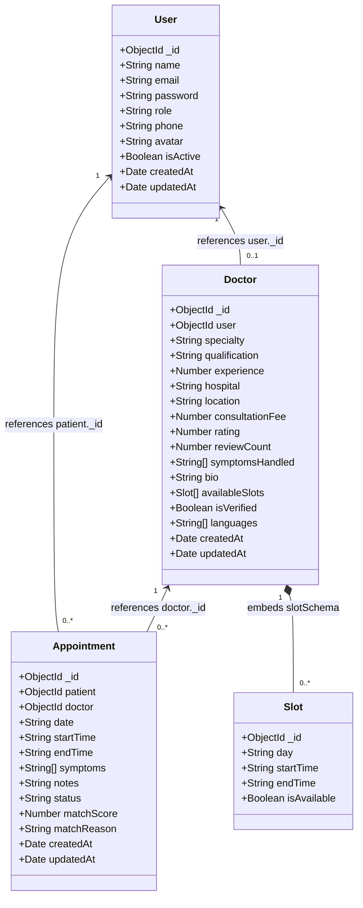

# 🏥 MediBook

MediBook is a premium symptom-based doctor booking platform designed to match patients with the right medical specialists using an explainable match scoring system.

## 🚀 Key Features

* **Symptom-Based Recommendation**: Calculates a % match score and provides clear reasons (explainability) showing why a doctor is recommended based on their handled conditions.
* **Role-Based Portals**:
  * **Patients**: Search by symptoms/specialty, view doctor bios and matched scores, book slots, cancel appointments, and update security profiles.
  * **Doctors**: Manage upcoming consultations, check patient notes and symptom lists, and mark visits as completed.
  * **Admins**: Monitor system metrics, manage user activation status, and run sample doctor data seeding.
* **In-Memory Fallback DB**: Integrates `mongodb-memory-server` as an automatic fallback if a local MongoDB connection is unavailable, making the setup plug-and-play.
* **Premium UX/UI**: Styled using custom, harmonious color palettes, smooth transitions, and responsive grid layouts.

---

## 📊 Database Class Diagram

The following diagram illustrates the relationship between the MongoDB collections defined in the Mongoose schemas:



### Collection Explanations
* **User**: Manages credentials, contact info, status flags (`isActive`), and permissions (`role` parameter controls navigation and API access).
* **Doctor**: Extends the `User` collection for users with the `'doctor'` role. Houses clinical parameters such as specialty, fee details, location, rating stats, and handled symptoms.
* **Slot**: An embedded sub-document schema nested inside `Doctor` representing slots on specific days (e.g. Monday 10:00 - 10:30).
* **Appointment**: Joins a patient `User` and a `Doctor` document. Saves matching metrics (`matchScore`, `matchReason`) compiled at the exact time of booking for historical reference.

---

## 🛠️ Tech Stack

* **Frontend**: React (v19), React Router (v7), Vite, React Hot Toast, React Icons.
* **Backend**: Node.js, Express (v5), Mongoose, JSON Web Tokens (JWT), BcryptJS.
* **Database**: MongoDB (supporting local installation and automated In-Memory mock server fallback).

---

## 💻 Getting Started

### Prerequisites
* [Node.js](https://nodejs.org/) installed (v18+ recommended)
* Git

### Installation

1. **Clone the repository**:
   ```bash
   git clone https://github.com/snigdhasirivalli/medi_book.git
   cd medi_book
   ```

2. **Backend Setup**:
   ```bash
   cd backend
   npm install
   # Create a .env file based on backend/.env setup
   npm run dev
   ```

3. **Frontend Setup**:
   ```bash
   cd ../frontend
   npm install
   # Create a .env file containing VITE_API_URL=http://localhost:5001/api
   npm run dev
   ```

4. **Access the App**:
   Navigate to the local address printed by Vite (typically `http://localhost:5173/`).
